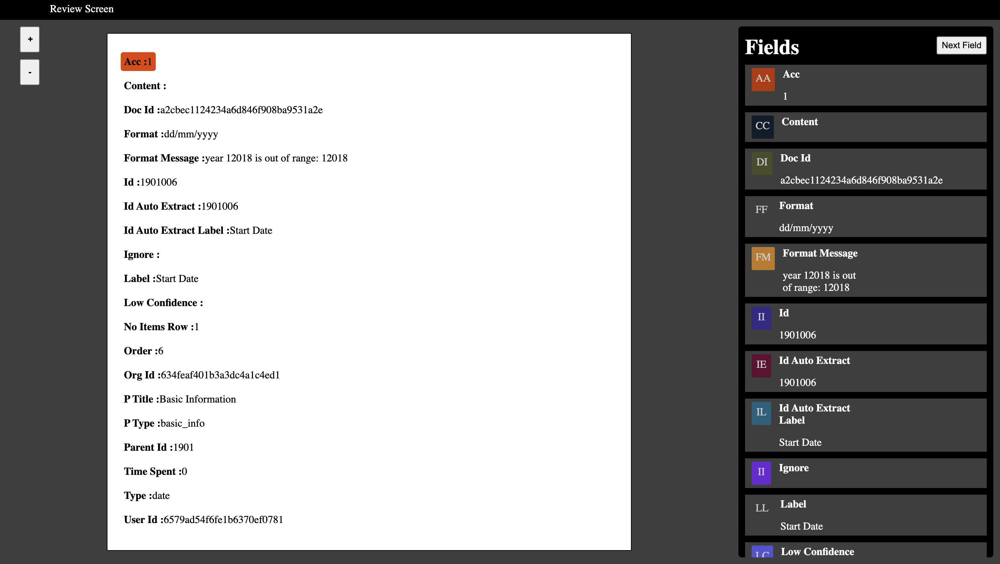

# Review-Screen
A review screen built using react

## File structure
The global level assets are added in the assets folder.
The components are added to the Components folder.
The util function are added to the services folder.

## Packages
No npm packages are used for this project. The stylings are written in plain css files and the components are added to .js files.

## Interface

